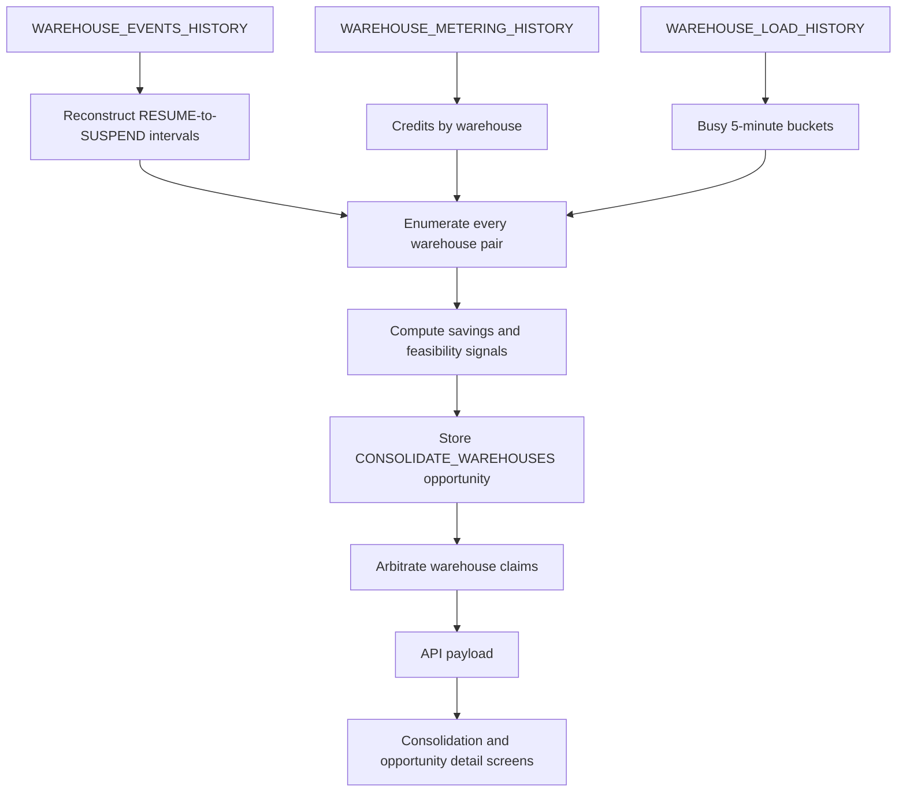

# 17 - Warehouse Consolidation: Business and Implementation Guide

**Audience:** Anyone who needs to understand, validate, or change SnowLens warehouse consolidation  
**Scope:** The business idea, current implementation, field meanings, formulas, safety checks, accounting, UI, and known gaps  
**Source of truth:** This guide distinguishes the richer product design from what the code implements today

---

## 1. The idea in one minute

Snowflake bills a warehouse while it is running. If two warehouses are running during the same wall-clock period, two sets of warehouse-seconds are being purchased. A consolidated warehouse may cover that period with one running warehouse instead of two.

SnowLens therefore asks two separate questions:

1. **Is there money to recover?** Did the warehouses have simultaneous uptime?
2. **Is the merge operationally safe?** Were they busy at different times, and would their combined load fit?

Those questions must not be confused:

| Observation | Business meaning |
|---|---|
| High **uptime overlap** | Good savings potential: two warehouses were paid for at once. |
| Low **busy overlap** | Good feasibility: their actual workloads rarely demanded capacity at once. |
| Low **combined peak concurrency** | Good feasibility: the merged load is less likely to queue. |

The ideal pair has **high uptime overlap but low busy overlap**. Both warehouses stay awake for long periods, but they do useful work at different times. Consolidation removes duplicated awake time without stacking much active work.

This is not simply "find two underused warehouses." A pair can have large theoretical savings and still be a bad merge because of queueing, workload isolation, security, SLA, ownership, or chargeback requirements.

---

## 2. Business logic

### 2.1 Why a merge can save credits

Suppose warehouse A is running from 00:00 to 24:00 and warehouse B is running from 06:00 to 30:00.

```text
Time       00:00       06:00                       24:00       30:00
A          [--------------------------------------------------]
B                      [--------------------------------------------------]

Separate uptime:       24h + 24h = 48 warehouse-hours
Merged uptime union:   00:00 through 30:00 = 30 hours
Duplicated uptime:     48h - 30h = 18 warehouse-hours
```

The 18-hour intersection is paid twice today. Under the simple merge counterfactual, it is paid once.

The implemented estimate is:

$$
\text{estimated credits}_{p50}
= (\text{sum uptime hours} - \text{union uptime hours})
\times \min(\text{observed rate}_A, \text{observed rate}_B)
$$

where:

$$
\text{observed rate}_W
= \frac{\text{metered credits for }W}{\text{reconstructed uptime hours for }W}
$$

For the example, if both warehouses used 24 credits over 24 uptime hours, each observed rate is 1 credit/hour:

$$
(48 - 30) \times \min(1, 1) = 18\text{ credits}
$$

At the configured rate of $1 per credit, the UI reports $18 for the analysis lookback period.

### 2.2 Why the cheaper rate is used

The current code values every removed overlap hour at the lower observed hourly burn of the two members. This is conservative when one warehouse is more expensive than the other, but it is not a target-sizing model. It does not decide whether the target should be Small, Medium, multi-cluster, or another configuration.

### 2.3 What must remain true after a merge

A useful recommendation must preserve more than credit savings:

- acceptable queueing and latency;
- workload isolation, especially interactive versus batch traffic;
- role and security boundaries;
- ownership and chargeback attribution;
- target capacity and multi-cluster behavior;
- operational reversibility.

The product design includes these concerns. The current implementation only measures a subset of them, as detailed in section 9.

---

## 3. End-to-end data flow



### Step 1: Reconstruct billed uptime

`reconstruct_intervals()` groups events by warehouse and cluster, opens an interval on `RESUME` or `SPINUP`, and closes it on `SUSPEND` or `SPINDOWN`.

Important current behavior:

- intervals shorter than 60 seconds are extended to 60 seconds;
- an interval is persisted only after a matching close event;
- a warehouse still running at the end of extraction has no open-ended interval persisted;
- intervals are grouped by warehouse for consolidation, so cluster-level intervals can contribute to the same warehouse's duration.

### Step 2: Build busy signals

Load rows are aligned by `bucket_start`. A bucket is busy when `avg_running > 0`.

For each pair SnowLens computes:

$$
\text{busy overlap}
= \frac{|\text{busy buckets}_A \cap \text{busy buckets}_B|}
{|\text{busy buckets}_A \cup \text{busy buckets}_B|}
$$

and:

$$
\text{combined peak}
= \max_t(\text{avg running}_{A,t} + \text{avg running}_{B,t})
$$

If neither member has a positive `avg_running` bucket, `busy_known` is false. This means "no usable positive-load evidence," not necessarily "both warehouses were idle."

### Step 3: Enumerate pairs

The analyzer creates every unique pair from warehouses that have reconstructed uptime intervals. With $n$ warehouses this is $n(n-1)/2$ pair evaluations.

A pair is skipped when:

- either member has no reconstructed intervals; or
- the members have no simultaneous uptime, so sum uptime equals union uptime.

The current generator does **not** skip a pair because its busy or concurrency gates fail.

### Step 4: Price the counterfactual

The counterfactual is stored as:

```json
{
  "operation": "MergeWarehouses",
  "members": ["WH_A", "WH_B"]
}
```

This is advisory metadata. SnowLens does not execute a Snowflake change and does not currently identify a target warehouse or target size.

### Step 5: Store and arbitrate

Every priced pair is initially inserted with status `recommended`. A later arbitration pass gives uptime-affecting opportunities one coarse claim key per warehouse. Higher-`p50` opportunities are considered first. If any warehouse key is already owned, the later opportunity becomes `suppressed`.

For example, if `A+B` is worth 18 credits and `A+C` is worth 12, `A+B` wins first and `A+C` is suppressed because both claim warehouse A.

This prevents one warehouse from appearing in multiple winning changes, but the current implementation arbitrates entire warehouses rather than exact overlapping time intervals.

---

## 4. The two overlaps

The word **overlap** currently refers to two different calculations. This is the most important naming trap in the feature.

### `temporal_overlap` / candidate `overlap`

This is Jaccard overlap of reconstructed **uptime intervals**:

$$
\frac{\text{simultaneous uptime}}{\text{sum uptime} - \text{simultaneous uptime}}
$$

It measures savings potential. The UI badge labelled "uptime overlap" displays this value. Higher generally means more duplicated running time.

### `busy_overlap`

This is Jaccard overlap of positive-load **busy buckets**. It measures operational collision. Lower generally means a safer merge.

### Documentation mismatch

The KPI implementation spec defines C3 as busy-time Jaccard. In current code, `evidence.temporal_overlap` is uptime Jaccard while `evidence.busy_overlap` is the C3-like busy-time Jaccard. Use the explicit evidence names rather than assuming every occurrence of "temporal overlap" means C3.

---

## 5. Current calculation, line by line

For warehouses A and B:

1. Sum the duration of A's intervals into `left_seconds`.
2. Sum the duration of B's intervals into `right_seconds`.
3. Add those values into `sum_seconds`.
4. Merge all overlapping intervals from both warehouses and measure them once as `union`.
5. Compute `simultaneous_seconds = sum_seconds - union`.
6. Return no candidate if `simultaneous_seconds <= 0`.
7. Divide each warehouse's metered credits by its uptime hours to get two observed hourly rates.
8. Multiply simultaneous hours by the cheaper rate to get `estimated_credits_p50`.
9. Add load-based feasibility fields.
10. Store fixed low/high bands at `p50 * 0.8` and `p50 * 1.1`.

Despite their names, the current `p10` and `p90` values are **not percentile estimates or bootstrap results**. They are fixed factors around the point estimate.

The candidate also computes an internal score:

$$
\text{candidate score}
= (1 - \text{busy overlap}) - \max(0, \text{combined peak} - 1)
$$

This rewards disjoint busy windows and penalizes peak load above 1.0. However, this `score` is not persisted as the opportunity's `priority_score`. The stored priority score is currently just `estimated_credits_p50` and may later be replaced by API ranking logic elsewhere.

---

## 6. Field glossary

### 6.1 Inputs and intermediate candidate fields

| Field | Unit/type | Meaning |
|---|---|---|
| `warehouse_a`, `warehouse_b` | string | Pair member names passed into the calculator. |
| `intervals` | map of lists | Reconstructed uptime intervals keyed by warehouse. |
| `credits` | map of numbers | Metered credits summed by warehouse for the run. |
| `left_seconds` | seconds | Total reconstructed uptime for A. Internal only. |
| `right_seconds` | seconds | Total reconstructed uptime for B. Internal only. |
| `sum_seconds` | seconds | A uptime plus B uptime, counting simultaneous time twice. Internal only. |
| `union` | seconds | Wall-clock uptime covered by either member, counting shared time once. Internal only. |
| `simultaneous_seconds` | seconds | `sum_seconds - union`; duplicated paid uptime. Internal only. |
| `rate_a`, `rate_b` | credits/hour | Total metered credits divided by reconstructed uptime. Internal only. |
| `warehouses` | string array | The two pair members. |
| `overlap` | ratio 0..1 | Jaccard overlap of uptime intervals. Becomes `temporal_overlap` in evidence. |
| `busy_overlap` | ratio 0..1 | Jaccard overlap of positive-load buckets. Low is preferred. |
| `busy_known` | boolean | Whether at least one positive-load bucket exists across the pair. |
| `combined_peak` | average running queries | Maximum aligned sum of members' `avg_running`. |
| `feasible` | boolean | True if busy data is unknown, or both implemented load thresholds pass. |
| `score` | number | Internal disjointness/peak score; currently not persisted. |
| `estimated_credits_p50` | credits/lookback | Point estimate from duplicated uptime times cheaper observed rate. |
| `sum_uptime_hours` | warehouse-hours/lookback | Separate member uptime added together. |
| `union_uptime_hours` | hours/lookback | Hypothetical merged uptime coverage. |

### 6.2 Opportunity fields returned by the API

| Field | Meaning for consolidation |
|---|---|
| `opportunity_id` | Stable run-derived identifier such as `consolidate-<run>-<a>-<b>`. |
| `run_id_created` | Analysis run that produced the opportunity. |
| `type` | Always `CONSOLIDATE_WAREHOUSES`. |
| `status` | Usually `recommended`, `suppressed`, or `dismissed`; verification may add later states. |
| `warehouse_names` | JSON-decoded pair member names. |
| `estimated_credits_p10` | Currently `p50 * 0.8`; not a measured 10th percentile. |
| `estimated_credits_p50` | Implemented point estimate in credits for the extraction lookback. |
| `estimated_credits_p90` | Currently `p50 * 1.1`; not a measured 90th percentile. |
| `estimated_usd_p50` | `estimated_credits_p50 * SNOWLENS_RATE_USD_PER_CREDIT`, or the stack/default rate. |
| `confidence_class` | Hardcoded `observational`. The interval arithmetic is deterministic, but target behavior is not proven. |
| `risk` | Hardcoded `medium` in code; the product catalog describes consolidation as medium-high risk. |
| `effort` | Hardcoded `architecture`. |
| `priority_score` | Initially equal to `estimated_credits_p50`. |
| `bucket` | `structural`, because medium-risk architecture work is not a quick win. |
| `evidence` | Measurements that explain the recommendation; detailed below. |
| `counterfactual` | Proposed `MergeWarehouses` operation and members. |
| `gates` | Safety-check results. They are displayed but not enforced during candidate insertion. |

### 6.3 `evidence` object

```json
{
  "temporal_overlap": 0.6,
  "busy_overlap": 0.2,
  "busy_known": true,
  "combined_peak_concurrency": 0.8,
  "feasible": true,
  "members": ["WH_A", "WH_B"],
  "sum_uptime_hours": 48.0,
  "union_uptime_hours": 30.0
}
```

| Evidence field | How to read it |
|---|---|
| `temporal_overlap` | Fraction of the pair's uptime union during which both were up. High is attractive for savings. |
| `busy_overlap` | Fraction of distinct busy buckets in which both were busy. Low is attractive for safety. |
| `busy_known` | False means load feasibility could not be established from positive-load buckets. |
| `combined_peak_concurrency` | Highest aligned sum of `avg_running`; current threshold is 1.0. |
| `feasible` | Calculator summary. Note that unknown busy data produces `true` here while two gates fail closed. |
| `members` | Warehouses included in the pair. |
| `sum_uptime_hours` | Current separate warehouse-hours over the run's lookback. |
| `union_uptime_hours` | Estimated merged awake hours over the same lookback. |

### 6.4 Gate fields

Each gate has `code`, `label`, and `passed`.

| Gate | Current pass rule | Interpretation |
|---|---|---|
| `GATE_UPTIME_OVERLAP` | `uptime_overlap > 0` | There is duplicated running time to remove. |
| `GATE_BUSY_DISJOINT` | `busy_known and busy_overlap <= 0.5` | At most half the pair's busy buckets collide. |
| `GATE_CONCURRENCY_FEASIBLE` | `busy_known and combined_peak <= 1.0` | Peak average running load fits the current one-warehouse heuristic. |
| `GATE_REVERSIBLE` | Always true | Code assumes the routing/config change can be reverted. |

There is a subtle inconsistency when load data is unknown:

- candidate `feasible` is true because the code cannot disprove feasibility;
- busy and concurrency gates are false because they require `busy_known`;
- the opportunity is still inserted as `recommended`.

Treat such a card as **unverified feasibility**, not as evidence that the merge is safe.

---

## 7. Reading the UI

The consolidation screen shows:

- **Merge A + B:** the proposed members, not a selected target topology;
- **uptime overlap badge:** `evidence.temporal_overlap`, not busy overlap;
- **sum uptime:** current separate warehouse-hours;
- **union uptime:** estimated awake time after merge;
- **saving hours:** sum minus union;
- **estimated dollars:** point-estimate credits multiplied by the configured dollar rate;
- **gates:** evidence checks, whether or not they affected status.

The UI currently labels saved time as `h/mo`. The calculation itself uses the configured extraction lookback, which is 30 days in `config/snowlens-alpha.yml` but is not inherently monthly. If the lookback changes, read this as **hours per lookback period**.

The statement "exact, not modelled" applies to interval union arithmetic. It does not mean the entire business outcome is exact. The following remain modeled or assumed: target rate, target capacity, queueing behavior, cache effects, workload routing, and whether the observed event history is complete.

---

## 8. Arbitration and double-counting

Consolidation competes with other uptime-changing ideas. The same warehouse-hours cannot honestly fund both an auto-suspend card and a consolidation card.

The design calls for interval-level claims, dependency ordering, gate enforcement, and optional repricing after earlier counterfactuals. The current code uses a simpler rule:

1. Sort all claim-bearing opportunities by `estimated_credits_p50` descending.
2. Claim each complete warehouse name.
3. Suppress an opportunity if any claimed warehouse already has a winner.

Current claim-bearing types are `IDLE_AUTOSUSPEND`, `CONSOLIDATE_WAREHOUSES`, and `RIGHTSIZE_DOWN`.

Consequences:

- two winning consolidations cannot share a warehouse;
- consolidation may lose to a larger auto-suspend estimate on either member;
- the winner is based on gross `p50`, not the documented business dependency order;
- exact time slices are not compared;
- consolidation is not repriced on post-auto-suspend intervals;
- the savings ledger is populated for generated opportunities even when arbitration suppresses one, so consumers must pay attention to status.

The portfolio total returned by analysis excludes suppressed claims. Individual cards are not automatically additive.

---

## 9. Implemented today versus intended design

| Concern | Product/KPI design | Current implementation |
|---|---|---|
| Savings basis | Union versus sum of uptime, preferably after auto-suspend composition | Implemented on raw reconstructed intervals. |
| Busy overlap | C3 Jaccard of busy windows | Implemented as `busy_overlap`. |
| Combined capacity | p99 combined load against target size and cluster capacity | Maximum aligned `avg_running`; fixed threshold `<= 1.0`. |
| Gate enforcement | Failed hard gate suppresses opportunity | Gates are stored; candidate is still inserted as `recommended`. |
| Unknown load data | Degrade confidence / request evidence | Candidate says feasible, load gates fail, status remains recommended. |
| Workload affinity C7 | Table-set affinity or degraded query metadata | Not implemented in consolidation generation. |
| Role/security affinity C8 | Role-set overlap gate | Not implemented. |
| SLA conflict C9 | Interactive plus batch conflict is a hard gate | Not implemented. |
| Size compatibility C10 | Compare member size ranks | Not implemented. |
| Target topology | Choose target size/max clusters conservatively | No target size or warehouse is selected. |
| Cache benefit | Secondary evidence/benefit | Not calculated. |
| Uncertainty | Bootstrap p10-p90 | Fixed `0.8x` and `1.1x` factors. |
| Risk | Medium-high due to blast radius/isolation | Stored as `medium`. |
| Claims | Exact warehouse-by-time claims in dependency order | Coarse warehouse-name claims, sorted by gross `p50`. |
| Verification | Detect retirement/rerouting and run difference-in-differences | Generic verification facilities exist; merge-specific detection is not part of candidate generation. |

This table is the boundary between **a useful candidate finder** and **a production-ready merge decision**. Current cards should begin an engineering review, not authorize a merge by themselves.

---

## 10. Worked decision example

Assume:

| Input | WH_A | WH_B |
|---|---:|---:|
| Uptime | 24h | 24h |
| Metered credits | 24 | 48 |
| Observed rate | 1 credit/h | 2 credits/h |

Their combined uptime union is 30h, so duplicated uptime is 18h.

```text
p50 credits = 18h * min(1, 2) = 18 credits
p10 field    = 18 * 0.8 = 14.4 credits
p90 field    = 18 * 1.1 = 19.8 credits
```

Now assume the load buckets produce:

```text
busy_overlap = 0.20
combined_peak = 0.80
busy_known = true
```

All implemented gates pass. This pair is a reasonable review candidate.

Change only the load evidence:

```text
busy_overlap = 0.90
combined_peak = 1.80
busy_known = true
```

The savings estimate is still 18 credits because uptime math did not change. The candidate's `feasible` field becomes false and two gates fail. **Current code nevertheless stores it as recommended.** A human or downstream workflow must reject it.

This illustrates why savings potential and operational feasibility are separate dimensions.

---

## 11. Review checklist before acting

### Savings validity

- Does the extraction window represent normal operations rather than an incident or holiday?
- Are RESUME/SUSPEND events complete, including warehouses still running at the boundary?
- Do metered credits and reconstructed uptime cover the same period?
- Is the cheaper observed rate a credible rate for the proposed target?
- Has auto-suspend savings already claimed the same uptime?

### Capacity and performance

- Do both busy and concurrency gates pass with sufficient load coverage?
- What are p95/p99 concurrency, queueing, spill, latency, and burst behavior?
- What target size and max-cluster setting will carry the combined workload?
- Are interactive and batch SLAs compatible?
- Could a runaway workload starve the other workload after isolation is removed?

### Security and ownership

- Are role, network, data access, and policy boundaries compatible?
- Will warehouse monitors and resource limits still enforce the intended controls?
- Can finance preserve chargeback using query tags, roles, or another allocation key?
- Do the warehouse owners agree on routing, maintenance, and incident ownership?

### Rollout and verification

- Define a reversible routing/config plan and rollback threshold.
- Establish pre-change credits, queue, latency, spill, and failure baselines.
- Canary one workload or time window before fully retiring a member.
- Verify that traffic moved and the old warehouse stopped consuming credits.
- Compare observed combined credits with the predicted union and track realization rate.

---

## 12. Troubleshooting surprising cards

### "The savings are zero or the pair is missing"

- The warehouses may never have been up at the same time.
- One member may lack a complete RESUME-to-SUSPEND interval.
- Metering may be missing, making an observed rate zero even when overlap exists.
- The consolidation capability may be disabled.

### "The card is recommended even though a gate failed"

This is current behavior. Generation stores every pair with positive simultaneous uptime as recommended. Gates are evidence, not an enforced filter.

### "Feasible is true but the gates fail"

Check `busy_known`. Unknown load data is treated optimistically by the candidate calculator but fails closed in gate display.

### "The dollar number looks too small"

Check the dollar-per-credit setting and extraction lookback. The alpha YAML uses `$1.00` per credit and 30 days. Also check whether one warehouse has zero or unusually low metered credits relative to reconstructed uptime.

### "Uptime overlap and busy overlap disagree"

That can be the best consolidation pattern. Warehouses can both be awake for most of the day while doing useful work at different times.

### "Why was a good pair suppressed?"

Another higher-value uptime-affecting opportunity probably claimed either warehouse first. Inspect opportunity status and `app_opportunity_claims`.

---

## 13. Code map

| Responsibility | Location |
|---|---|
| Interval union, uptime overlap, busy overlap, peak, savings | `snowlens/opportunities.py` |
| Pair enumeration, evidence, fixed bands, persistence, claims | `snowlens/analysis.py` |
| Four displayed consolidation gates | `snowlens/gates.py` |
| RESUME/SUSPEND reconstruction and 60-second minimum | `snowlens/semantic/intervals.py` |
| Coarse claim arbitration and portfolio total | `snowlens/arbitration.py` |
| JSON decoding and dollar conversion | `snowlens/api.py` |
| Consolidation explorer and savings bars | `frontend/src/screens/Consolidation.jsx` |
| Calculation-focused regression tests | `tests/test_phase1b.py` |
| Intended C1-C10 model | `docs/10-kpi-implementation-spec.md` |
| Intended opportunity contract | `docs/04-opportunity-catalog.md` |
| Intended claim accounting | `docs/05-savings-accounting.md` |

---

## 14. Mental model to keep

Use this four-part test whenever you read or modify consolidation logic:

1. **Overlap:** Is duplicated paid uptime large enough to matter?
2. **Fit:** Can combined active load meet capacity and SLA requirements?
3. **Compatibility:** Can security, ownership, isolation, and chargeback coexist?
4. **Accounting:** Is the saving incremental after competing opportunities and verified after rollout?

The current implementation answers most of question 1, part of question 2, none of question 3 automatically, and a coarse version of question 4. That makes it a candidate discovery system, not yet a complete warehouse merge decision engine.
